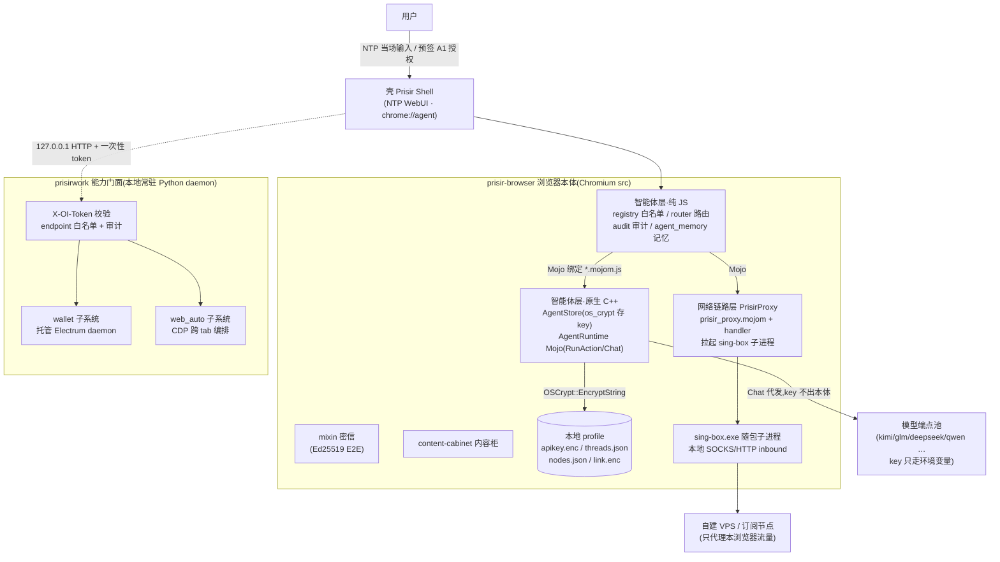
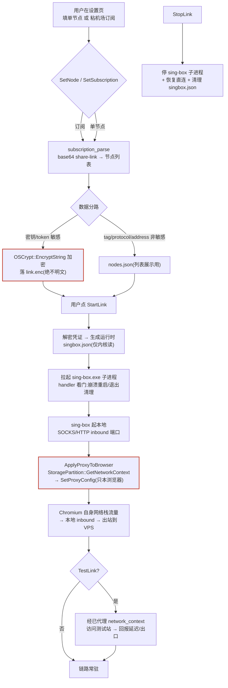
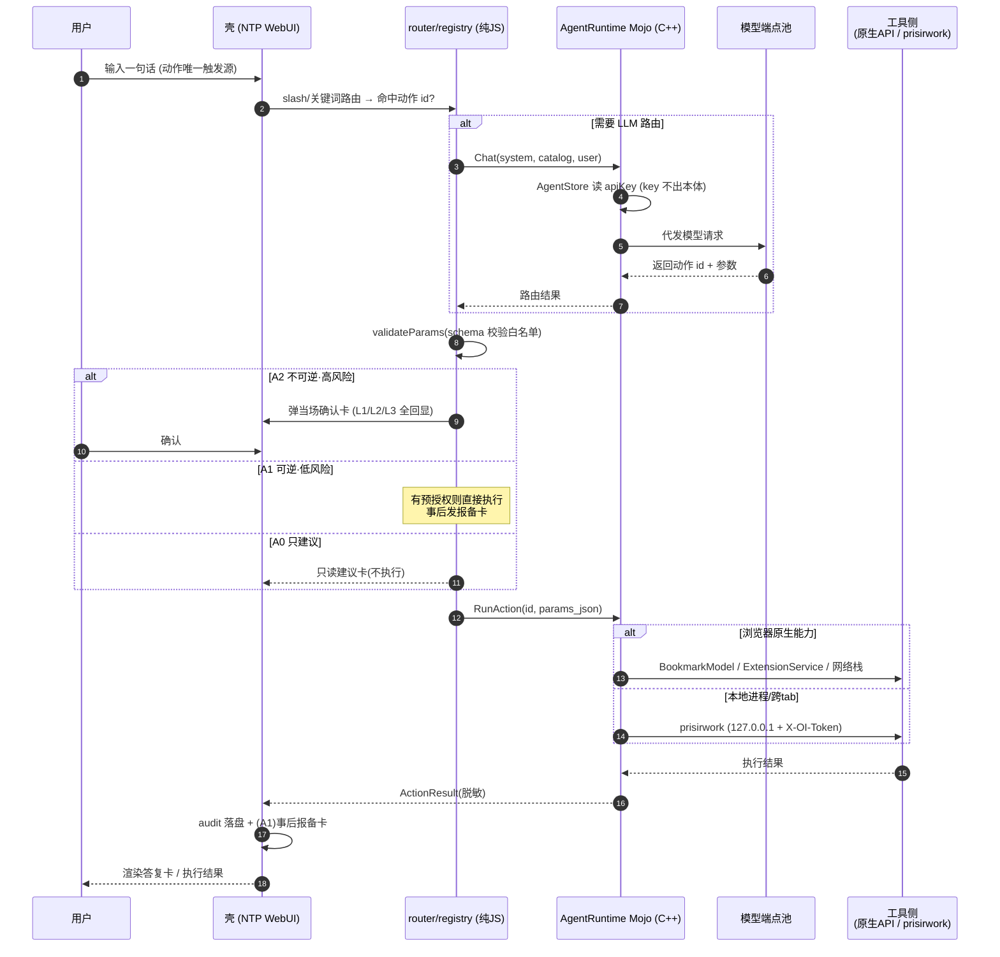

# Prisir 浏览器架构文档(2026-08-14)

> 定位:**Prisir 浏览器 = 无账号、本地优先的 Chromium 浏览器 + 内嵌 Agent 操作层 + 内嵌网络链路层**。
> 数据默认落本地 profile,不要账号、默认不上云;AI 是浏览器的"受控雇员"而非云端服务的前端;
> 自带 sing-box 内嵌链路,出口自主。

---

## 1. 整体框架

下图展示两大簇的关系:**prisir-browser 浏览器本体**(智能体层 / 网络链路层 / 密信 / 内容柜)与 **prisirwork 能力门面**(本地常驻 daemon),以及壳、模型端点池、自建节点等外部角色。

要点:壳只做入口与渲染;碰浏览器/碰钱/碰网络的执行都在原生层或门面层,纯 JS 层只承载路由、校验与审计这类宿主无关逻辑。

---

## 2. 开发模块概览

### 2.1 agent 操作层(prisir-browser/agent)

- **M2 契约(数据基座)**:AgentStore 为 profile 级存储 —— 配置进 PrefService、apiKey 走 os_crypt 加密落盘(`apikey.enc`)、会话/记忆落 profile JSON(`threads.json` / `memories.json`)。
- **M3 契约(能力映射)**:15 个白名单动作逐个定「插件 API → 本体原生 API」映射;registry / router / audit / product_knowledge / skill_* 为纯 JS 零改动直搬;`agent_memory` 负责对话提炼 → 记忆卡(A0 默认只建议)。
- **白名单机制**:模型输出只能「选白名单 id + 填 schema 参数」,不能发明动作;无 eval、无任意 shell、无任意 OAuth。
- **动作自主权三级**:
  - **A0 只建议**:只读分析,永不执行;
  - **A1 可逆·低风险**:用户预授权后自动执行 + 事后报备卡(默认开,体现智能);
  - **A2 不可逆·高风险**:永需当场确认卡(L1 内嵌卡 / L2 全回显 / L3 安全对话框),默认不开。
- 管家第二层「模型研判」判出的动作同样须过 registry 校验,不合规降级 A0 建议卡。

### 2.2 proxy 网络链路层(prisir-browser/proxy)

- **形态**:PrisirProxy 为 profile 级 KeyedService,`prisir_proxy.mojom` 定义页面侧接口(配置节点/订阅、StartLink/StopLink/TestLink、查询状态),`.cc` handler 实现。
- **sing-box 内嵌**:拉起随包 sing-box.exe 子进程起本地 SOCKS/HTTP inbound,只代理 Chromium 自身 network_context(`StoragePartition::GetNetworkContext → SetProxyConfig`);**不开 TUN、不读系统代理、不枚举其它应用流量**。
- **os_crypt_async**:密钥/token 经 `OSCrypt::EncryptString` 异步加密落 `link.enc`,tag/protocol/address 等非敏感字段落 `nodes.json` 供列表展示;**无 GetNode 回明文接口**,解密只在生成运行时 `singbox.json` 瞬间发生,加密失败直接返回失败、不降级。
- **看门逻辑**:handler 监控子进程,崩溃自动重启、退出清理运行时配置;StopLink 停子进程 + 恢复直连。

### 2.3 prisirwork 地基(能力门面)

- **定位**:127.0.0.1 本地常驻 Python daemon,是"浏览器沙箱"与"本地进程"之间的受控桥。
- **双入口/子系统**:
  - **wallet**:托管 Electrum daemon(本地 CLI 进程),浏览器侧钱包能力经门面转发;
  - **web_auto**:CDP 跨 tab 编排,补浏览器原生 API 之外的自动化面。
- **门禁**:所有 endpoint 过 `X-OI-Token` 一次性令牌校验 + endpoint 白名单 + 调用审计;token 由壳一次性下发,不持久、不外发。

### 2.4 oiagent 协作团队

- oiagent 为项目开发协作智能体,运行于本地对话壳(Prisir Shell),受【项目宪法】硬性契约约束(Ed25519 唯一签名、凭证只走环境变量、本地优先、红线诚实标注)。
- 开发任务以 task 切片下发(M1/M2/M3 范式:源码/契约先行,真编译时按契约落地);测试数据带唯一 TAG 且真自清理,E2E 真跑不假 PASS。

---

## 3. 网络链路层运行流程

下图刻画从"用户配置节点"到"浏览器流量走 sing-box"的完整链路,红色节点为安全红线落点。

要点:凭证全程"只进不出"——加密落盘、运行时瞬解、无任何回明文的查询接口;代理面严格限于本浏览器,不碰系统级网络。

---

## 4. Agent 子系统一次对话调用时序

下图展示从用户输入到答复渲染的完整时序,含模型路由、白名单校验与 A2 当场确认门槛。

要点:模型只负责"选动作 + 填参数",执行权永远在用户(当场输入/预授权/确认卡)手里;Chat 是 apiKey 唯一出手通道。

---

## 5. 关键安全红线

> 以下五条为硬性契约,违反即返工;实现上不接受安慰剂占位(如 `validate(){return true}`),要么真实实现要么标 TODO,验收清单不得据此打 ✅。

1. **key 不出本体**:apiKey 只在 AgentStore(os_crypt 加密落盘)与 Chat Mojo 代发瞬间经手,页面/扩展/JS 层永远拿不到明文;凭证只走环境变量,永不硬编码进源码/补丁/日志/LLM 上下文。
2. **os_crypt 加密落盘**:一切敏感数据(apiKey、节点凭证、link.enc)经 Chromium `OSCrypt::EncryptString`(Windows DPAPI / macOS Keychain / Linux libsecret)加密后落盘;磁盘文件不得出现明文;无回明文查询接口;加密失败即失败,不降级。
3. **白名单唯一出口**:模型输出只能"选白名单动作 id + 填 schema 参数",不能发明动作;无 eval / 任意 shell / 任意 OAuth;管家模型研判的动作同样须过 registry 校验,不合规降级 A0。
4. **页面不触发动作**:动作触发源只能是 NTP 用户当场输入,或用户预先签署的 A1 级授权;页面内容/附件/模型中间产物**永不触发新动作**;定时任务只能到点"提醒/预填",真正执行仍等用户确认。
5. **默认本地(默认知地)**:数据默认落本地 profile,默认不上云、不要账号;任何上传明示 + opt-in;代理面只限本浏览器(不开 TUN/不读系统代理);E2E 不降级,密信私钥不出原生层。
