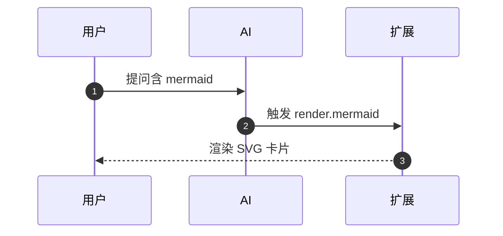
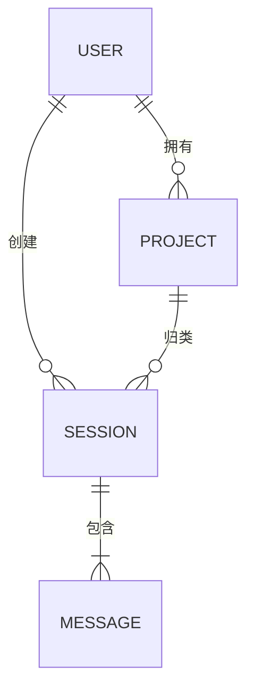
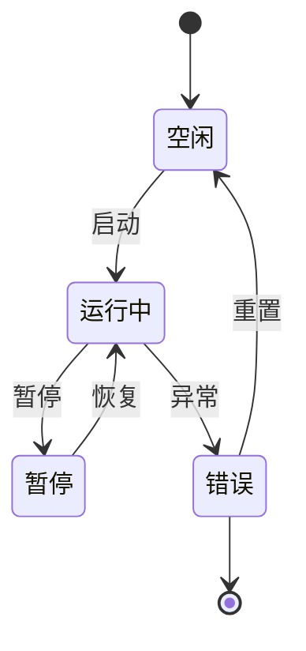
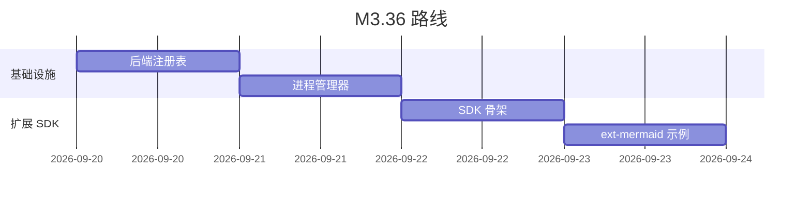
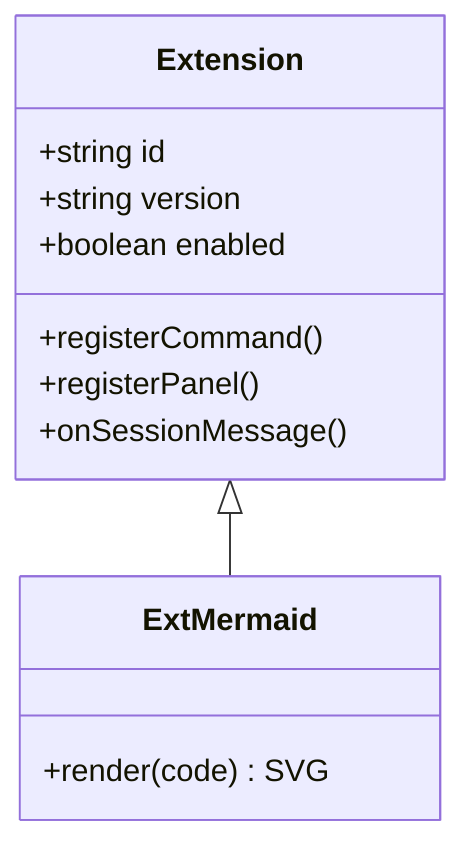

# diagram-design-prisir

Editorial-grade 图。**灵感来源** https://github.com/cathrynlavery/diagram-design
(40 种 type、4/10 密度、1-2 accent 焦点、"先考虑不画")。

> **本 skill 不复制原仓文件,避免装包膨胀。** 远程参考 URL 见文末。

---

## 品牌令牌(写死,不可改)

| token | 值 | 用途 |
|-------|----|----|
| `paper` | `#fdfcf8` | 背景(米色纸面) |
| `ink` | `#2f3a34` | 主文字 |
| `ink-muted` | `#7a8580` | 次文字 |
| `accent-primary` | `#c0392b` | 朱砂红(第一焦点) |
| `accent-secondary` | `#3a7d6a` | 松石绿(第二焦点) |
| `accent-warm` | `#d4a574` | 赭石(辅助) |
| `font-sans` | `-apple-system, "PingFang SC", "Microsoft YaHei", sans-serif` | 中文 |
| `font-serif` | `"Source Han Serif SC", "Noto Serif CJK SC", serif` | 宋体标题 |
| `font-mono` | `"JetBrains Mono", "SF Mono", monospace` | 代码/标签 |
| `radius` | `6px` | 卡片圆角 |
| `stroke` | `1.5px` | 描边粗细 |
| `density` | `4/10` | 元素密度(留白 60%) |

**WCAG AA 合规**:任何文字背景对比度 ≥ 4.5:1。

---

## 何时画 vs 不画(soft 引导)

### 不画的 5 种情况
1. 3 个以内节点的简单关系 → 用文字列表
2. 已经在文字里说清楚流程 → 不要重复图
3. 没有 accent 焦点 → 等找到焦点再画
4. 节点 > 20 个 → 拆成多张图
5. 用户没明确要图 → **默认不画**

### 要画的触发
- 用户说「画个 X 图」「做个 X」「给我看看 X 长什么样」
- 解释复杂架构 / 流程 / 关系,且文字 > 200 字
- 对比 3+ 选项

---

## 输出格式

**强制走 mermaid fenced block**,代码围栏标 ` ```mermaid `。原因:
- 现有渲染管线 `_renderMermaidIn` 已经支持 mermaid@11.4.1 ESM CDN
- NSIS 已 ship v2.7.5,换渲染栈风险大
- 「设计稿渲染」扩展(M3.36 Phase 1.3)会自动检测并升级成 SVG 卡片

**禁止**:
- ❌ 输出独立 .html 文件(PrisirAI 是对话流,不是文档系统)
- ❌ 输出 base64 PNG(占带宽,不可重排)
- ❌ 触发外部资源(除非走扩展审核白名单)

---

## 40 种类型(远程参考)

原仓 https://github.com/cathrynlavery/diagram-design 提供以下 type 参考
(**只读 URL,不复制文件**):

| 类别 | 类型 |
|------|------|
| 流程类 | flowchart / sequence / state / activity / swimlane / BPMN |
| 架构类 | C4 / UML-class / component / deployment |
| 数据类 | ER / sankey / funnel / waterfall / radar / polar / treemap |
| 时间类 | gantt / timeline / roadmap |
| 思维类 | mindmap / fishbone / wardley / kanban |
| 网络类 | graph / network / packet |
| 决策类 | decision-tree / decision-matrix |
| 地理类 | map / geo-heatmap |
| 概念类 | concept-map / venn / tree |
| 表格类 | comparison / quadrant / matrix |
| 自定义 | editorial-style / minimal / mono / dark / neo |

> **WebFetch URL**(每次画图前 fetch 1 次,缓存 24h):
> `https://raw.githubusercontent.com/cathrynlavery/diagram-design/main/README.md`

---

## Editorial-grade 风格 7 条铁律

1. **4/10 密度** — 元素占版面 ≤ 40%,留白 ≥ 60%
2. **1-2 accent 焦点** — 全图最多 2 个朱砂/松石节点,其他全用墨色
3. **先考虑不画** — 默认不画,只在必要/被请求时画
4. **节点命名 < 4 字** — 中文 ≤ 4 字,英文 ≤ 2 词
5. **统一描边** — `1.5px` round cap,绝不堆阴影
6. **方向性** — flowchart / sequence 永远 L→R 或 T→B,不交叉
7. **品牌令牌写死** — 任何颜色/字体引用令牌,不要用 hex

---

## 6 种最常用图范本

### 1. flowchart(流程图)


### 2. sequence(时序图)


### 3. ER 图


### 4. state(状态机)


### 5. gantt(甘特)


### 6. UML class


---

## 关联

- [[prisIr-diagram-design-integration]] — 整合评估(2026-09-17)
- [[PrisirAI 整合 diagram-design 方案]] — 路线 A+B 拍板
- 「设计稿渲染」扩展(M3.36 Phase 1.3)— 渲染管线实现
- `_renderMermaidIn` in prisIragent_web.py:5159-5185 — 现有渲染入口
- `prisIragent_cli.py:2639-2644` — 现有 6 行 prompt(将被重写为 editorial 版)